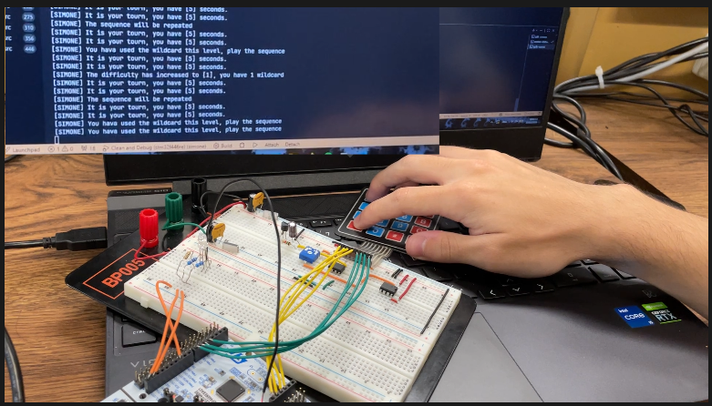
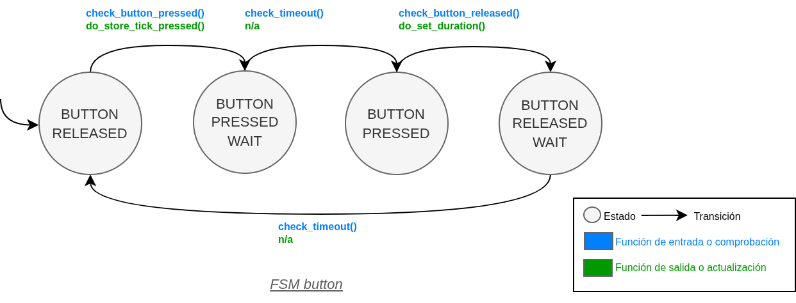
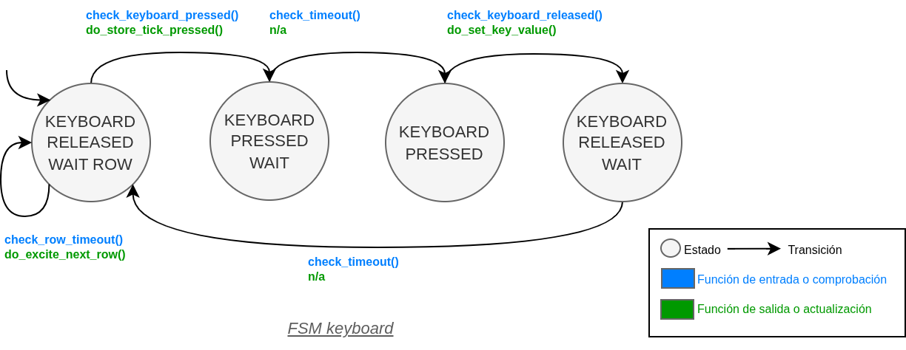
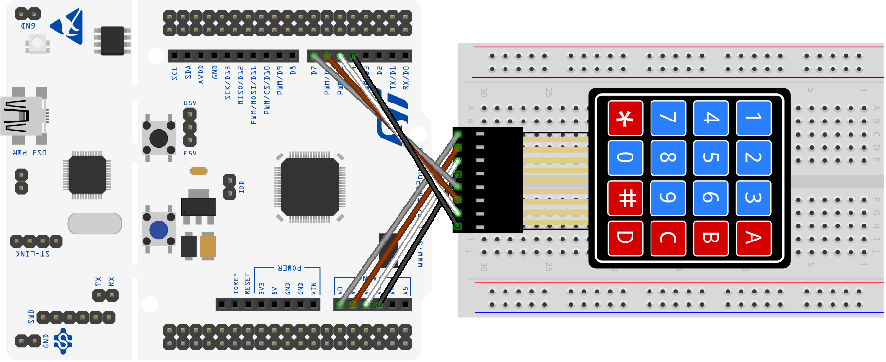
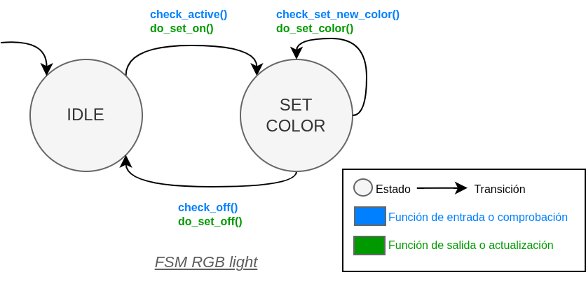
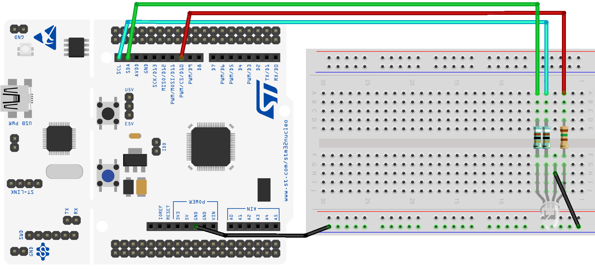
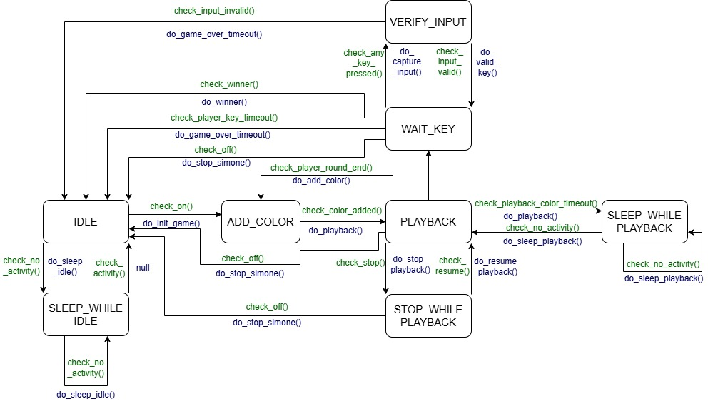
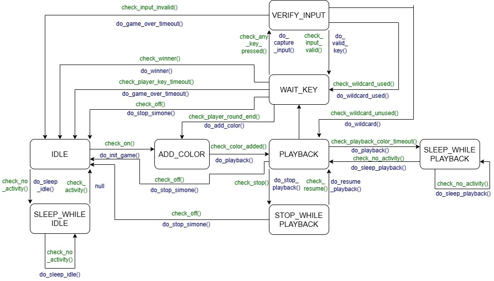

# Simone - Juego de memoria para STM32F4

Acceso a la documentación y API del proyecto en [este enlace](https://sdg2dieupm.github.io/simone/).

## Authors

* **Alumno 1** - email: [n.delosrios@alumnos.upm.es](mailto:n.delosrios@alumnos.upm.es)
* **Alumno 2** - email: [alejandro.suarez@alumnos.upm.es](mailto:alejandro.suarez@alumnos.upm.es)

---

## Descripción del proyecto

Este proyecto implementa el clásico juego de memoria visual **Simon**, adaptado a una placa STM32F4 Nucleo-F446RE utilizando programación C y una arquitectura basada en máquinas de estados finitos (FSM).

El sistema utiliza:

- Un teclado matricial 4x4 para introducir las secuencias.
- Un LED RGB para representar visualmente los colores del juego.
- El botón de usuario de la placa para controlar el sistema.
- Temporizadores e interrupciones hardware del microcontrolador STM32F446RE.

This project implements the classic **Simon** memory game on an STM32F4 Nucleo-F446RE board using C programming and finite state machines (FSM).

The system includes:

- A 4x4 matrix keyboard for user interaction.
- An RGB LED for visual feedback.
- The onboard user button to control the system.
- Hardware timers and interrupts from the STM32F446RE microcontroller.

---

## Hardware utilizado

- Placa Nucleo-STM32F446RE
- Teclado matricial 4x4
- LED RGB
- Protoboard y cables Dupont
- Cable USB

---

## Características principales

- Programación bare-metal sobre STM32.
- Gestión de interrupciones.
- Temporización mediante SysTick.
- Arquitectura modular separando capas `COMMON` y `PORT`.
- Uso de FSM para el control del sistema.
- Generación PWM para el LED RGB.
- Modos de bajo consumo.
- Documentación automática mediante Doxygen.

---

## Estructura del proyecto

```bash
simone/
├── README.md
├── common
│   ├── CMakeLists.txt
│   ├── include
│   │   ├── fsm_button.h
│   │   ├── fsm_keyboard.h
│   │   ├── fsm_rgb_light.h
│   │   ├── fsm_simone.h
│   │   ├── keyboards.h
│   │   └── rgb_colors.h
│   └── src
│       ├── fsm_button.c
│       ├── fsm_keyboard.c
│       ├── fsm_rgb_light.c
│       ├── fsm_simone.c
│       ├── keyboards.c
│       └── rgb_colors.c
├── example
│   ├── CMakeLists.txt
│   ├── example_v1.c
│   ├── example_v2.c
│   └── example_v3.c
├── main.c
├── port
│   ├── CMakeLists.txt
│   ├── include
│   │   ├── port_button.h
│   │   ├── port_keyboard.h
│   │   ├── port_rgb_light.h
│   │   ├── port_simone.h
│   │   └── port_system.h
│   └── stm32f4
│       ├── CMakeLists.txt
│       ├── include
│       │   ├── stm32f4_button.h
│       │   ├── stm32f4_keyboard.h
│       │   ├── stm32f4_rgb_light.h
│       │   ├── stm32f4_simone.h
│       │   └── stm32f4_system.h
│       └── src
│           ├── interr.c
│           ├── stm32f4_button.c
│           ├── stm32f4_keyboard.c
│           ├── stm32f4_rgb_light.c
│           ├── stm32f4_simone.c
│           ├── stm32f4_system.c
│           └── syscalls.c
└── test
    ├── CMakeLists.txt
    ├── stm32f4
    │   ├── CMakeLists.txt
    │   ├── test_port_button.c
    │   ├── test_port_keyboard.c
    │   └── test_port_rgb_light.c
    ├── test_fsm_button.c
    ├── test_fsm_keyboard.c
    └── test_fsm_rgb_light.c
```

---

## Demostración en vídeo de V5

[](https://youtu.be/-9pPiyt7cc8)


---

# Modo de juego

Se pulsa el botón de usuario 1 segundo para encender el sistema y comenzará la reproduccion de la secuencia, tras esta tendrá que introducir la secuencia con el teclado. En el caso de querer repetirla puede pulsar la tecla **wildcard** para que se vuelva a reproducir, esto solo lo puede hacer 1 vez por nivel. Al superar la prueba con 5 colores se pasará al nivel siguiente, hasta completar el dicifil donde habrá ganado el juego.

| Tecla        | Color        |
|--------------|--------------|
| 0            | Blanco       |
| 1            | Rojo         |
| 2            | Verde        |
| 3            | Azul         |
| 5            | Amarillo     |
| 8            | Turquesa     |
| *            | Wildcard     |

---

# Versiones del proyecto

## Version 1

Implementación inicial del proyecto y configuración básica del sistema:

- Configuración del entorno de desarrollo.
- Inicialización del sistema STM32F4.
- Configuración de GPIOs.
- Implementación del temporizador SysTick.
- Funciones básicas de temporización y manejo del hardware.
- [FSM de Version 1](fsm__button_8c.html)


---

## Version 2

Implementación del teclado matricial 4x4:

- Excitación secuencial de filas.
- Lectura de columnas mediante interrupciones.
- Captura y decodificación de teclas.
- FSM de control del teclado.
- Integración hardware del keypad.
- [FSM de Version 2](fsm__keyboard_8c.html)



---

## Version 3

Implementación del sistema visual mediante LED RGB:

- Configuración de salidas PWM.
- Control de colores e intensidades.
- Representación visual de secuencias.
- Feedback visual al usuario.
- Integración del módulo RGB con el sistema.
- [FSM de Version 3](fsm__rgb__light_8c.html)



---

## Version 4

Integración completa del juego Simone:

- Implementación de la lógica principal del juego.
- Gestión del encendido y apagado del sistema.
- Control mediante el botón de usuario.
- Reproducción de secuencias.
- Comprobación de entradas del jugador.
- Gestión de errores y reinicio de partida.
- Integración completa de FSMs.
- Optimización y modos de bajo consumo.
- [FSM de Version 4](fsm__simone_8c.html)

---

## Version 4bis

Integración de pausa del playback de la secuencia:
- Al pulsar el botón de usuario un tiempo menor al de encendido el sistema entra en pausa, al volver a pulsarlo sale del estado.



---

## Version 5

Funcionalidades avanzadas y mejoras adicionales:

- Implementacion del botón '*' como wildcard, permite repetir la secuencia de playback una vez por nivel


---

## Referencias

- [STM32F446RE Datasheet](https://www.st.com/resource/en/datasheet/stm32f446re.pdf)
- [RM0390 Reference Manual](https://www.st.com/resource/en/reference_manual/rm0390-stm32f446xx-advanced-armbased-32bit-mcus-stmicroelectronics.pdf)
- [Repositorio Simone](https://github.com/sdg2DieUpm/simone)

---

## Licencia

Proyecto académico desarrollado para la asignatura Sistemas Digitales II de la Universidad Politécnica de Madrid (UPM).